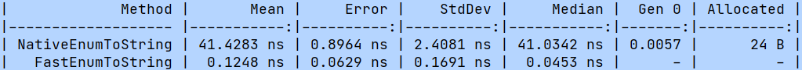

<h2>LearnBenchmark</h2>
Making some benchmarks with nuget package BenchmarkDotNet.
<h3>Results</h3>

<h4>BenchmarkCycles:</h4>

<h4>BenchmarkEnumToString:</h4>

 

<h4>BenchmarkSearchByCondition</h4>

